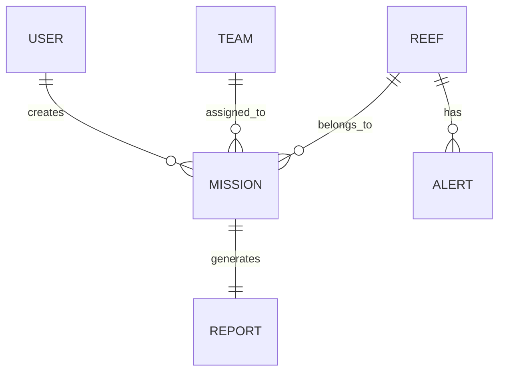

# Ocean Sentinel OS

# Database Design

> Version: 1.0
>
> Database: SQLite (Development)
>
> Production Ready: PostgreSQL
>
> ORM: SQLAlchemy

---

# Table of Contents

1. Database Overview
2. Entity Relationship Diagram
3. Database Tables
4. Relationships
5. Constraints
6. Indexing Strategy
7. Sample Data
8. Future Expansion

---

# 1. Database Overview

Ocean Sentinel OS stores operational marine conservation data required for monitoring reefs, planning missions, managing teams, generating reports, and authenticating users.

Primary Entities:

- Users
- Teams
- Reefs
- Missions
- Reports
- Alerts

---

# 2. Entity Relationship Diagram

---

# 3. Database Tables

---

## USERS

Purpose

Stores government officers and administrators.

| Column | Type | Constraint |
|---------|------|------------|
| id | Integer | Primary Key |
| employee_id | String | Unique |
| full_name | String | Required |
| email | String | Unique |
| password_hash | String | Required |
| role | String | Required |
| organization | String | Required |
| assigned_region | String | Nullable |
| created_at | DateTime | Default Current Timestamp |

---

## TEAMS

Purpose

Stores cleanup teams.

| Column | Type |
|---------|------|
| id | Integer |
| team_name | String |
| specialization | String |
| region | String |
| availability | Boolean |
| status | String |

---

## REEFS

Purpose

Stores coral reef information.

| Column | Type |
|---------|------|
| id | Integer |
| reef_name | String |
| country | String |
| latitude | Float |
| longitude | Float |
| coral_health | Float |
| sea_temperature | Float |
| bleaching_alert | Boolean |
| protected_area | Boolean |
| ghost_net_distance | Float |
| ai_priority_score | Float |
| priority_level | String |
| updated_at | DateTime |

---

## MISSIONS

Purpose

Stores cleanup missions.

| Column | Type |
|---------|------|
| id | Integer |
| mission_name | String |
| reef_id | Integer (FK) |
| team_id | Integer (FK) |
| created_by | Integer (FK) |
| mission_date | Date |
| priority | String |
| resources | String |
| notes | Text |
| status | String |
| created_at | DateTime |

---

## REPORTS

Purpose

Stores generated reports.

| Column | Type |
|---------|------|
| id | Integer |
| mission_id | Integer (FK) |
| generated_by | Integer (FK) |
| pdf_path | String |
| generated_at | DateTime |

---

## ALERTS

Purpose

Stores environmental alerts.

| Column | Type |
|---------|------|
| id | Integer |
| reef_id | Integer (FK) |
| alert_type | String |
| severity | String |
| message | Text |
| created_at | DateTime |

---

# 4. Relationships

## USER → MISSION

One User

↓

Creates Many Missions

Relationship

1 : N

---

## TEAM → MISSION

One Team

↓

Assigned to Many Missions

Relationship

1 : N

---

## REEF → MISSION

One Reef

↓

Many Missions

Relationship

1 : N

---

## MISSION → REPORT

One Mission

↓

One Report

Relationship

1 : 1

---

## REEF → ALERT

One Reef

↓

Many Alerts

Relationship

1 : N

---

# 5. Constraints

Users

- Email must be unique.
- Employee ID must be unique.

Teams

- Team Name should be unique.

Reefs

- Coordinates required.
- Coral Health between 0–100.
- Sea Temperature must be positive.

Missions

- Must reference an existing Reef.
- Must reference an existing Team.
- Mission Date cannot be in the past.

Reports

- Every report belongs to one mission.

Alerts

- Every alert belongs to one reef.

---

# 6. Indexing Strategy

Create indexes on:

USERS.email

USERS.employee_id

REEFS.country

REEFS.priority_level

MISSIONS.status

MISSIONS.mission_date

TEAMS.region

These indexes improve search and filtering performance.

---

# 7. Sample Data

## User

Employee ID: GOV001

Role: Marine Officer

Region: Great Barrier Reef

---

## Team

Team Name:

Coral Guardians Alpha

Specialization:

Ghost Net Removal

Availability:

Available

---

## Reef

Name:

Heron Reef

Country:

Australia

Priority:

HIGH

---

## Mission

Mission Name

Ghost Net Cleanup

Status

Planned

---

# 8. Future Expansion

Future tables may include:

- Satellite Images
- IoT Sensors
- Weather History
- Marine Species
- Drone Missions
- Audit Logs
- AI Predictions
- Citizen Reports

---

# Database Design Principles

- Avoid duplicate data.
- Use foreign keys for relationships.
- Store passwords only as hashes.
- Keep tables normalized.
- Use timestamps for important records.
- Design for future scalability.

---

# End of Document